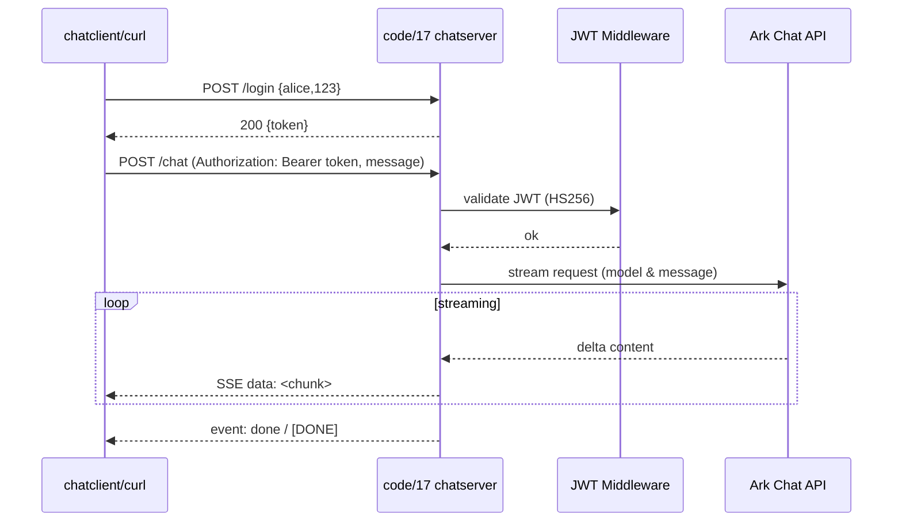

# 第15章：对话接口设计

## 接口设计示例（参考 code/17）
- 认证：`POST /login` 固定用户（示例 alice/123），返回 JWT Bearer；`/healthz` 免鉴权，其余接口携带 `Authorization: Bearer <token>`。
- 消息发送：`POST /chat`，请求体 `{ "message": "你好", "model": "可选覆盖默认" }`；从 `Config.ModelID` 或 `ARK_MODEL_ID` 取默认模型，最后回退 `deepseek-v3-250324`。
- SSE 响应：头 `Content-Type: text/event-stream`, `Cache-Control: no-cache`, `Connection: keep-alive`；对大模型流式响应每个增量写 `data: <chunk>\n\n`，结束时写 `event: done\ndata: [DONE]\n\n`，错误写 `event: error\ndata: <err>\n\n`。
- 并发与资源：`r.Context()` + `WithTimeout` 控制 60s；`Flusher` 每次写后冲刷，`defer stream.Close()`；客户端断开/超时即退出，避免泄漏。
- 安全与头：JWT 中间件跳过 `/login`/`/healthz`；统一安全头（nosniff/CSP/deny frame）；日志与 recover 中间件。

